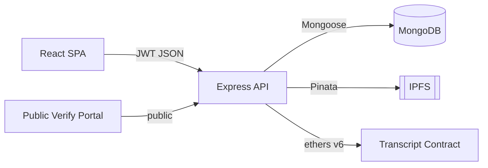

# VeriChain — Blockchain Academic Transcript Verification

VeriChain is a full-stack system for issuing tamper-proof academic transcripts and
verifying them in seconds. Institutions upload a transcript PDF; the system stamps
a verification QR code onto it, stores the document on IPFS, and anchors its
SHA-256 fingerprint on the Ethereum blockchain. Because the fingerprint lives
on-chain, anyone — an employer, a university, a government office — can confirm a
document is authentic and unaltered without trusting any central party.

The blockchain stores **only hashes and identifiers**; the PDF lives on IPFS and
personal data lives in MongoDB. Verification is a public, no-login flow: scan the
QR code (or upload the PDF) and the portal re-computes the hash and compares it to
the immutable on-chain record. Revocation is supported and is reflected instantly
in every verification.

---

## Table of contents

- [Architecture](#architecture)
- [Tech stack](#tech-stack)
- [Prerequisites](#prerequisites)
- [Quick start (Docker)](#quick-start-docker)
- [Local development](#local-development)
- [Smart contract deployment](#smart-contract-deployment)
- [Environment variables](#environment-variables)
- [API reference](#api-reference)
- [Testing](#testing)
- [Project structure](#project-structure)
- [Diagrams](#diagrams)

---

## Architecture

```
        ┌─────────────────────────────┐
        │        React SPA (Vite)      │
        │  dashboards · issue · verify │
        └───────────────┬─────────────┘
                        │ HTTPS / JSON (+ JWT)
                        ▼
        ┌─────────────────────────────┐
        │   Express API (Node.js)      │
        │  auth · roles · services     │
        └───┬───────────┬───────────┬──┘
            │           │           │
   Mongoose │           │ Pinata    │ ethers.js v6
            ▼           ▼           ▼
     ┌───────────┐ ┌─────────┐ ┌──────────────────────┐
     │  MongoDB  │ │  IPFS   │ │ AcademicTranscript    │
     │ metadata  │ │  PDFs   │ │ Contract (Ethereum)   │
     └───────────┘ └─────────┘ └──────────────────────┘
```



Full diagrams (architecture, issuance/verification sequences, ER, contract state
machine) live in [`docs/diagrams`](docs/diagrams).

---

## Tech stack

| Layer | Technology |
|---|---|
| Smart contract | Solidity ^0.8.20, Hardhat |
| Blockchain | Ganache (local) → Sepolia testnet |
| Backend | Node.js 20+, Express, ethers.js v6 |
| Database | MongoDB (Mongoose) |
| File storage | IPFS via Pinata (local-store fallback) |
| Auth | JWT (access + refresh) |
| Frontend | React 18 + Vite, Tailwind CSS |
| QR / PDF | `qrcode`, `pdf-lib`, `html5-qrcode` |
| Testing | Hardhat (Solidity), Jest + Supertest (API) |

---

## Prerequisites

- **Node.js 20+** and npm
- **Docker + Docker Compose** (for the containerised stack)
- For local (non-Docker) dev: a running **MongoDB** and an Ethereum RPC
  (Ganache on `:7545`, or `npx hardhat node`)

---

## Quick start (Docker)

The compose stack runs MongoDB, Ganache, a one-shot contract deployer, the API,
and the frontend. The deployer writes the contract address + ABI to a shared
volume the backend reads — so it works end-to-end with **no manual steps**.

```bash
docker compose up --build
```

| Service | URL |
|---|---|
| Frontend | http://localhost:5173 |
| API | http://localhost:5000/api/health |
| Ganache RPC | http://localhost:7545 |
| MongoDB | mongodb://localhost:27017 |

First run: open the frontend, register an **admin** (the first admin is allowed to
self-register), then create + approve an institution, register a student, and
issue a transcript. The QR on the resulting PDF links to the public verify page.

---

## Local development

```bash
# 1. Contracts
cd contracts
npm install
npx hardhat node            # local chain on :8545  (or run Ganache on :7545)

# in a second terminal:
npx hardhat run scripts/deploy.js --network localhost
# → writes backend/src/config/contract.json automatically

# 2. Backend
cd ../backend
npm install
cp ../.env.example ../.env  # then fill in JWT secrets etc.
npm run dev                 # http://localhost:5000

# 3. Frontend
cd ../frontend
npm install
npm run dev                 # http://localhost:5173 (proxies /api → :5000)
```

> Without Pinata credentials the backend uses a local content-addressed store
> (`backend/.ipfs-store/`) so the full issue → verify flow still works offline.

---

## Smart contract deployment

The deploy script deploys the contract, logs the address, and writes the address +
ABI to `backend/src/config/contract.json`. It supports any Hardhat network:

```bash
# Local
npx hardhat run scripts/deploy.js --network localhost
# Ganache
npx hardhat run scripts/deploy.js --network ganache
# Sepolia testnet (requires SEPOLIA_RPC_URL + PRIVATE_KEY in .env)
npx hardhat run scripts/deploy.js --network sepolia
```

Set `CONTRACT_OUT=/path/contract.json` to also write to a second location (used by
the Docker deployer to publish into the shared volume).

---

## Environment variables

Copy `.env.example` → `.env`. Key variables:

| Variable | Description |
|---|---|
| `PRIVATE_KEY` | Operator/owner wallet key (contract owner). |
| `BLOCKCHAIN_MNEMONIC` | HD mnemonic used to derive per-institution custodial wallets. |
| `BLOCKCHAIN_NETWORK` | `ganache` or `sepolia`. |
| `GANACHE_URL` / `SEPOLIA_RPC_URL` | RPC endpoints. |
| `CONTRACT_ADDRESS` | Override the deployed address (else read from `contract.json`). |
| `CONTRACT_JSON_PATH` | Runtime path to a `contract.json` (Docker shared volume). |
| `MONGO_URI` | MongoDB connection string. |
| `JWT_SECRET` / `JWT_REFRESH_SECRET` | JWT signing secrets. |
| `JWT_ACCESS_TTL` / `JWT_REFRESH_TTL` | Token lifetimes (default `15m` / `7d`). |
| `PINATA_JWT` *or* `PINATA_API_KEY` + `PINATA_SECRET_API_KEY` | Pinata IPFS creds (optional). |
| `FRONTEND_URL` | Base URL used in QR verification links. |
| `PORT` | API port (default `5000`). |
| `VITE_API_URL` | Frontend → API base (default `/api`). |

---

## API reference

Full reference with request/response examples: [`backend/docs/API.md`](backend/docs/API.md).

| Method | Endpoint | Auth | Description |
|---|---|---|---|
| GET | `/api/health` | public | Service + chain status |
| POST | `/api/auth/register` | public | Sign up (verifier/student/institution/admin) |
| POST | `/api/auth/login` | public | Login → token pair |
| POST | `/api/auth/refresh` | public | New access token from refresh token |
| POST | `/api/auth/logout` | user | Revoke refresh token |
| GET | `/api/auth/me` | user | Current user |
| POST | `/api/institutions/register` | admin | Create institution |
| GET | `/api/institutions` | admin | List institutions |
| PATCH | `/api/institutions/:id/approve` | admin | Approve + register on-chain |
| GET | `/api/institutions/:id/students` | institution/admin | Institution roster |
| GET | `/api/institutions/me` | institution | Own institution |
| GET | `/api/institutions/admin/users` | admin | All users |
| POST | `/api/students/register` | institution/admin | Register a student |
| GET | `/api/students/:id` | institution/student/admin | Get a student |
| GET | `/api/students/me` | student | Own profile |
| POST | `/api/transcripts/issue` | institution | Issue (PDF → IPFS → chain → QR) |
| GET | `/api/transcripts` | institution/student/admin | List (scoped) |
| GET | `/api/transcripts/:id` | institution/student/admin | Get one |
| GET | `/api/transcripts/student/:studentId` | institution/student/admin | By student |
| POST | `/api/transcripts/:id/revoke` | institution | Revoke |
| GET | `/api/transcripts/:id/download` | institution/student/admin | Download PDF |
| GET | `/api/verify/:transcriptId` | **public** | Verify by id |
| POST | `/api/verify/upload` | **public** | Verify an uploaded PDF |
| GET | `/api/verify/:transcriptId/document` | **public** | View the PDF |

---

## Testing

```bash
# Smart contracts — 24 tests, 100% line / function coverage
cd contracts && npx hardhat test
cd contracts && npx hardhat coverage

# Backend API — Jest + Supertest, in-memory MongoDB, mocked chain/IPFS
cd backend && npm test

# Frontend — production build
cd frontend && npm run build
```

---

## Project structure

```
blockchain-transcript/
├── contracts/
│   ├── contracts/AcademicTranscriptContract.sol
│   ├── test/AcademicTranscriptContract.test.js
│   ├── scripts/deploy.js
│   ├── docs/CONTRACT.md
│   └── hardhat.config.js
├── backend/
│   ├── src/
│   │   ├── config/        # env, db, blockchain config + contract.json
│   │   ├── models/        # User, Institution, Student, Transcript
│   │   ├── middleware/    # auth, role, upload, error
│   │   ├── services/      # hash, qr, pdf, ipfs, blockchain, provision
│   │   ├── routes/        # auth, institution, student, transcript, verify
│   │   ├── controllers/
│   │   ├── utils/         # ApiError, asyncHandler, jwt, logger
│   │   └── app.js
│   ├── tests/             # auth, transcript, verify (+ setup)
│   ├── docs/API.md
│   └── Dockerfile
├── frontend/
│   ├── src/
│   │   ├── api/           # axios client + typed modules
│   │   ├── context/       # AuthContext, TranscriptContext
│   │   ├── components/    # layouts + UI components
│   │   ├── pages/         # auth, dashboards, issue, verify, scan
│   │   └── lib/
│   ├── nginx.conf
│   └── Dockerfile
├── docs/diagrams/         # architecture, sequences, ER, state machine (.mmd)
└── docker-compose.yml
```

---

## Diagrams

Rendered from [`docs/diagrams`](docs/diagrams) (Mermaid):

1. `architecture.mmd` — system architecture
2. `issue-sequence.mmd` — transcript issuance flow
3. `verify-sequence.mmd` — QR / upload verification flow
4. `er-diagram.mmd` — MongoDB collections & relationships
5. `contract-states.mmd` — transcript lifecycle (Issued → Revoked)

---

## License

MIT
